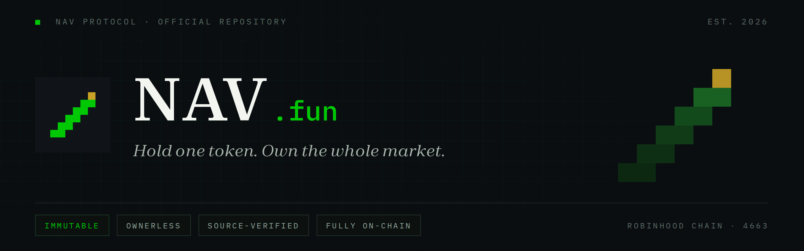
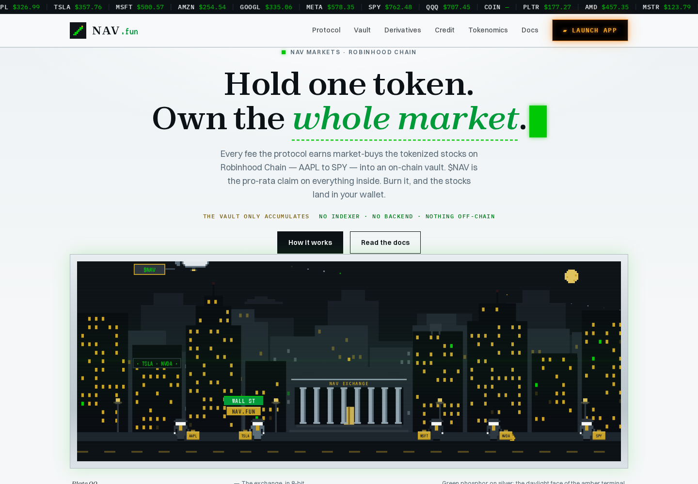
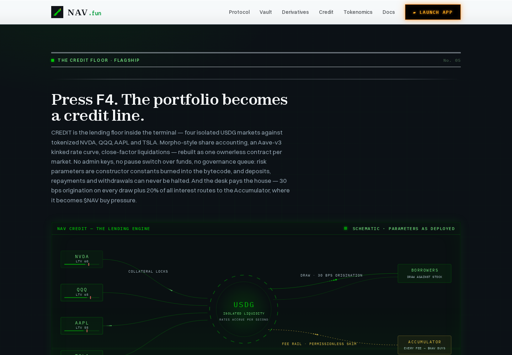
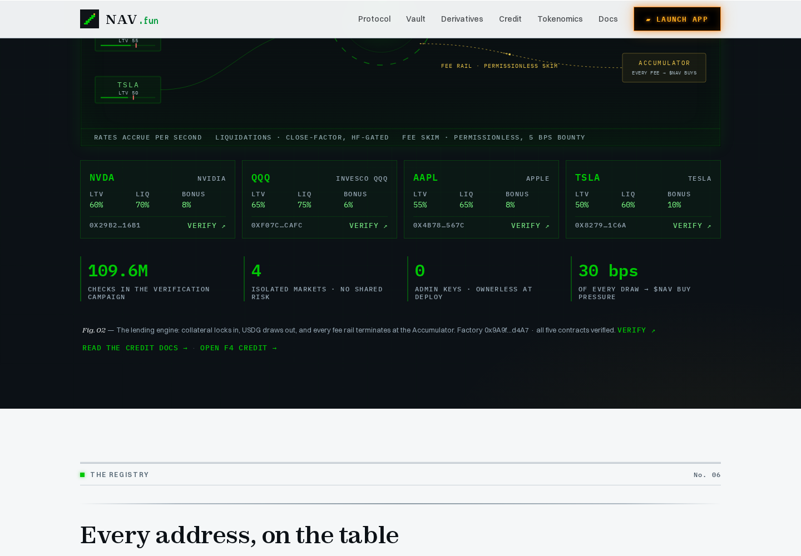
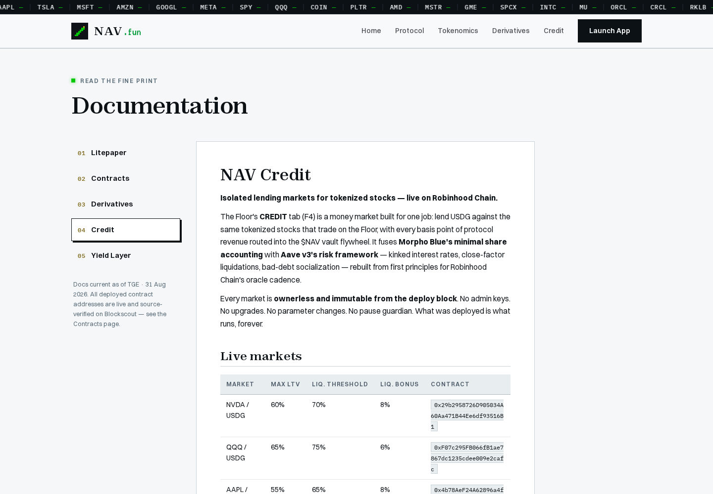
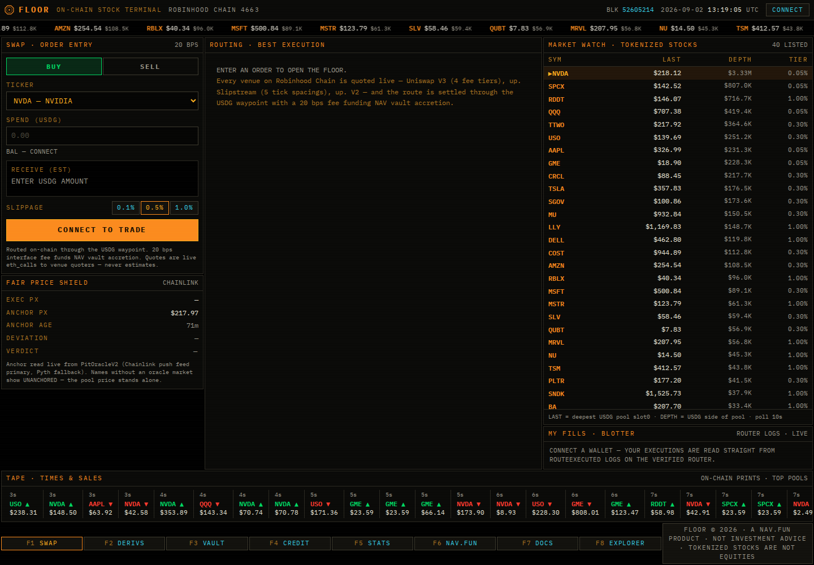
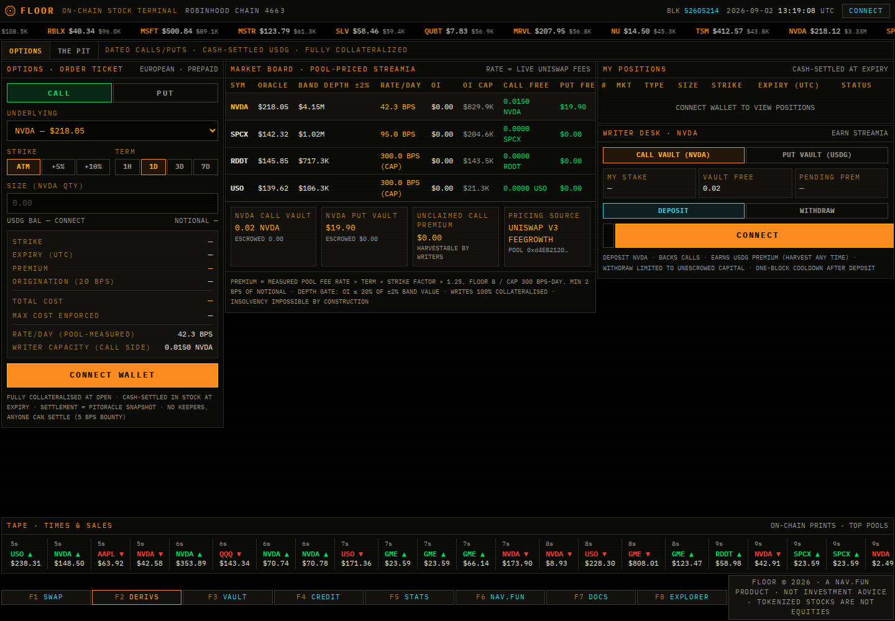
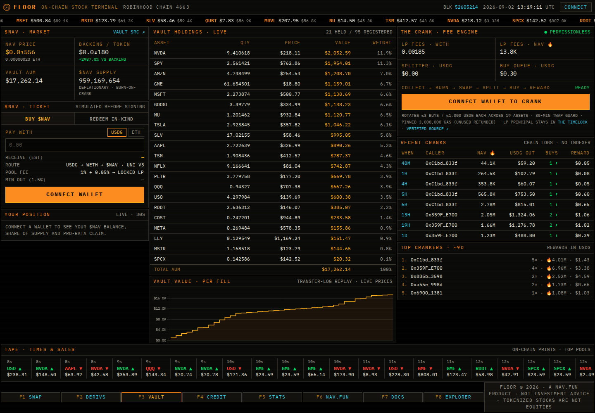
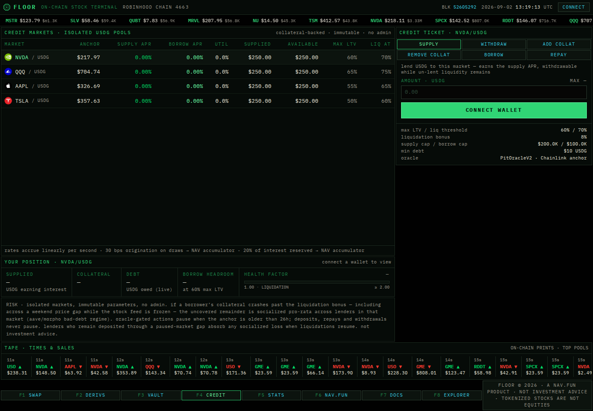

<p align="center">
  
</p>

<h1 align="center">NAV Protocol</h1>

<p align="center">
  <strong>Fee-funded stock accumulation, on-chain derivatives, isolated lending markets and a redeemable index share — live on Robinhood Chain (chain id 4663).</strong>
</p>

<p align="center">
  
  
  
  
  
</p>

NAV is a fully on-chain protocol stack built around one idea: route real trading fees into a transparent, redeemable vault of tokenized stocks, and price derivatives from measured market data rather than quoted volatility. No admin keys over user funds, no keepers, no off-chain dependencies. Every contract below is immutable and source-verified.

- **Site:** https://nav.fun
- **App:** https://nav.fun/floor/
- **Docs:** https://nav.fun/#/docs
- **Explorer:** https://robinhoodchain.blockscout.com

---

## Live deployment (Robinhood Chain 4663)

| Contract | Address |
|---|---|
| NAVToken | [`0x3e7f2c3A81a1c8302eacE254928e0fBa5A3Bc447`](https://robinhoodchain.blockscout.com/address/0x3e7f2c3A81a1c8302eacE254928e0fBa5A3Bc447) |
| NAVVault | [`0xb8F008322671179E2C93dd8610be8d5D7876087b`](https://robinhoodchain.blockscout.com/address/0xb8F008322671179E2C93dd8610be8d5D7876087b) |
| FeeSplitter | [`0x6bCA8944F711A2299a20ecb02E7AE25d78f81Ca2`](https://robinhoodchain.blockscout.com/address/0x6bCA8944F711A2299a20ecb02E7AE25d78f81Ca2) |
| AccumulatorV2 | [`0x3620Da2708734d1eE64D929cF9a05EAf9a7778a0`](https://robinhoodchain.blockscout.com/address/0x3620Da2708734d1eE64D929cF9a05EAf9a7778a0) |
| NavCrank | [`0x15F15c5513fb076ffaD48c80Ad65CC3EB009dD1e`](https://robinhoodchain.blockscout.com/address/0x15F15c5513fb076ffaD48c80Ad65CC3EB009dD1e) |
| NavSwapRouter | [`0xc8156712C1A654db7dcb805D8B9De15683fdc680`](https://robinhoodchain.blockscout.com/address/0xc8156712C1A654db7dcb805D8B9De15683fdc680) |
| NavOptions | [`0xd628eFeC572eE000D4Eb040E675744FEB35F2467`](https://robinhoodchain.blockscout.com/address/0xd628eFeC572eE000D4Eb040E675744FEB35F2467) |
| PitFactory | [`0x63859B6f3F6A717c35a872B55eaA0F2B6e7fDB77`](https://robinhoodchain.blockscout.com/address/0x63859B6f3F6A717c35a872B55eaA0F2B6e7fDB77) |
| PitOracleV2 | [`0x975F6D7E95bb7508A93fa68d510581CC0736Ffdd`](https://robinhoodchain.blockscout.com/address/0x975F6D7E95bb7508A93fa68d510581CC0736Ffdd) |
| PitTicket | [`0xd51C868353c084DA4c7685d755E7BFb9D41CA7b4`](https://robinhoodchain.blockscout.com/address/0xd51C868353c084DA4c7685d755E7BFb9D41CA7b4) |
| PitPoolDeployer | [`0x1600b2fe71F39216Eb3a7C04c626C9EdF75F3B7d`](https://robinhoodchain.blockscout.com/address/0x1600b2fe71F39216Eb3a7C04c626C9EdF75F3B7d) |
| NavPitHook | [`0xf45510A5cA0ecBa81C8998983d7fF1366849E503`](https://robinhoodchain.blockscout.com/address/0xf45510A5cA0ecBa81C8998983d7fF1366849E503) |
| YieldRouter | [`0x33091354fCF0F5AbF57F76A784eddBDF2fb2fFbB`](https://robinhoodchain.blockscout.com/address/0x33091354fCF0F5AbF57F76A784eddBDF2fb2fFbB) |
| LpTimelock | [`0xA5782C0A38b5d2C9fec4A6F11d2c0a94A21D36c6`](https://robinhoodchain.blockscout.com/address/0xA5782C0A38b5d2C9fec4A6F11d2c0a94A21D36c6) |
| CreditFactory | [`0x9A9feC2B6b05F94D8c3861d0202C05Df4Dcfd4A7`](https://robinhoodchain.blockscout.com/address/0x9A9feC2B6b05F94D8c3861d0202C05Df4Dcfd4A7) |
| CreditPair NVDA/USDG | [`0x29b2958726D905034A60Aa471B44Ee6df93516B1`](https://robinhoodchain.blockscout.com/address/0x29b2958726D905034A60Aa471B44Ee6df93516B1) |
| CreditPair QQQ/USDG | [`0xF07c295FB066fB1ae7867dc1235cdee009e2cafc`](https://robinhoodchain.blockscout.com/address/0xF07c295FB066fB1ae7867dc1235cdee009e2cafc) |
| CreditPair AAPL/USDG | [`0x4b78AeF24A62896a4f1381969EF4C9D28d2a567c`](https://robinhoodchain.blockscout.com/address/0x4b78AeF24A62896a4f1381969EF4C9D28d2a567c) |
| CreditPair TSLA/USDG | [`0x82797A109A840fa975616499F440C080730E1c6a`](https://robinhoodchain.blockscout.com/address/0x82797A109A840fa975616499F440C080730E1c6a) |

All contracts are verified on Blockscout with exact-match bytecode.

## Architecture

```
                    trading fees (NAV/WETH pool)
                              │
                          NavCrank          permissionless, cooldown-gated
                    ┌─────────┴─────────┐
                    ▼                   ▼
                NAV buyback         FeeSplitter ── 80 / 15 / 5
                  + burn                │
                                        ▼
                                  AccumulatorV2    TWAP + oracle-gated
                                        │          stock purchases
                                        ▼
                                    NAVVault       95-asset registry,
                                        │          in-kind redemption
                                        ▼
                              $NAV = redeemable share
   ────────────────────────────────────────────────────────────
   Derivatives layer (self-contained, USDG-settled):
     THE PIT  — dated calls/puts, pool-priced, oracle-settled
     OPTIONS  — European covered options, streamia-priced from
                measured Uniswap v3 fee growth, 100% collateralized
     SWAP     — dual-venue stock router with quote enforcement
     CREDIT   — four isolated USDG lending markets (NVDA, QQQ,
                AAPL, TSLA collateral); Morpho-style share
                accounting + Aave-v3 kinked rates; 30 bps
                origination + 20% of interest -> Accumulator
```

Full engineering specification: [`docs/CONTRACTS.md`](docs/CONTRACTS.md) · Protocol thesis: [`docs/LITEPAPER.md`](docs/LITEPAPER.md)

## NAV Credit — isolated lending markets

The flagship credit layer: four isolated USDG money markets against tokenized NVDA, QQQ, AAPL and TSLA, live behind the F4 CREDIT tab on the Floor.

- **Design:** Morpho Blue's minimal share accounting (virtual-share offsets 1000/1) fused with Aave v3's risk framework — kinked interest-rate model (80% kink, 8%→80% APR), close-factor liquidations with a health-factor gate, bad-debt socialization.
- **Immutable risk parameters** burned into bytecode at deploy: LTV/liquidation-threshold/bonus of 60/70/8% (NVDA), 65/75/6% (QQQ), 55/65/8% (AAPL), 50/60/10% (TSLA); 30 bps origination fee; 20% reserve factor; 5 bps permissionless skim bounty; 10 USDG minimum debt.
- **Ownerless from the deploy block:** no admin keys, no pause guardian over user funds, no upgrade path. Deposits, repayments and withdrawals can never be halted; borrows, collateral withdrawals and liquidations are oracle-freshness-gated.
- **Fee routing:** every basis point of protocol revenue is skimmed permissionlessly to the Accumulator, where it becomes $NAV buy pressure — the same flywheel that funds the vault.

Specification: [`docs/CREDIT.md`](docs/CREDIT.md) · Audits: [`audits/10-credit-contracts.md`](audits/10-credit-contracts.md), [`audits/11-credit-frontend.md`](audits/11-credit-frontend.md)

## Security

The protocol has been through repeated adversarial review before and after each deployment. Sanitized reports with methodology and results are published in [`audits/`](audits/README.md). Headline coverage across campaigns:

| Campaign | Scope | Coverage |
|---|---|---|
| Core protocol pre-deploy | Token, Vault, Splitter, Accumulator | Slither + unit/fuzz/gas-at-scale |
| Pit derivatives | PitPool, Oracle, Factory, Ticket | 92-test campaign, 4,096-run fuzz, 12,800-call invariants |
| Security campaign v6 | Full Pit redeploy | 2.4M randomized probes, 380-test regression, 9/9 invariants, 22/22 exact-match verification |
| NavCrank | Buyback/rotation engine | 3 independent passes, 1.05M fuzz runs, 190,800 invariant sequences, 419-test regression |
| StockSwap | Router + frontend | >43M total executions (10.1M contract fuzz, 33M frontend fuzz) |
| NavOptions | Options engine | 9M fuzz runs, 2.4M stateful calls, 14.4M invariant assertions, 0 failures |
| NAV Credit | CreditPair × 4 + CreditFactory + CREDIT tab | ~109.6M checks: 102.9M randomized harness executions, 2.8M fuzz runs, 3.84M invariant assertions, 112 unit tests, Slither clean |

Vulnerability disclosure: see [`SECURITY.md`](SECURITY.md).

## Interface

The protocol ships with two zero-backend frontends: **nav.fun** (protocol site) and **the Floor** (on-chain stock terminal). Every number rendered is read live from the chain — there is no indexer, no API server and no database. Captures below are from production.

| | |
|:---:|:---:|
|  |  |
| **nav.fun** — protocol homepage | **NAV Credit** — homepage introduction |
|  |  |
| **NAV Credit** — live market parameters | **Documentation** — 04 · Credit |
|  |  |
| **The Floor — F1 SWAP** — dual-venue router, fair-price shield | **The Floor — F2 DERIVS** — The Pit + streamia options |
|  |  |
| **The Floor — F3 VAULT** — live holdings, crank engine | **The Floor — F4 CREDIT** — isolated lending markets |

## Repository layout

```
contracts/   Foundry source of every deployed contract (verified on-chain),
             including the full NAV Credit test campaign (contracts/test/credit)
apps/        Frontend sources — site/ (nav.fun) and floor/ (the on-chain terminal)
docs/        Protocol documentation as published at nav.fun/#/docs
audits/      Sanitized audit reports and coverage summaries (12 reports)
media/       Brand assets and production interface captures
```

## License

Source-available, published for transparency and independent verification. All rights reserved — no license is granted to reuse, modify or redistribute this code.

## Disclaimer

Source is published for transparency and independent verification. Tokenized stocks are not equities. Nothing in this repository is investment advice. © NAV — all rights reserved.
